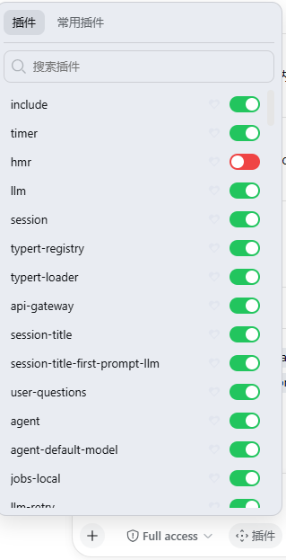

# @deepseek-ai/dsh-client-ui-plugin-controls

English | [中文](README.zh.md)

Plugin control panel, a browser surface plugin over the `@deepseek-ai/dsh-host-plugin-inventory` Remote. The browser half occupies the conversation-declared `conversation.input.plugins` single seat (immediately right of the access-mode control in the composer tool row); the node half is an empty apply (the roster row).

The trigger opens a portal panel that grows upward from the composer and stays inside the viewport (the composer sits at the bottom of the screen, so the panel owns the space above it and scrolls internally when tall). It lists every non-group Loader entry, grouped into all plugins and a user-marked favorites subset, with a name filter. Each row carries an enable/disable switch and a favorite mark button. Both writes ride the `pluginInventory` Remote: `setEnabled` writes an id-targeted `disabled` patch into the profile's user patch layer (`cordis.patch.yml`), which the launcher's `watchUserPatches` hot-reloads so the toggle takes effect without a restart and survives one; `setFavorite` writes the `plugin-favorites` Settings namespace. The panel holds only view state (open, group, query, optimistic rows) — no client-side business state.

> **⚠️ Runtime requirement.** The `conversation.input.plugins` seat and the `pluginInventory.setEnabled`/`setFavorite` Remotes are **not part of any released dsh** (as of 0.1.0-rc.8 and 0.1.1-rc.2). This plugin only runs on a dsh build that ships the plugin-control feature — either a source build with it or a future release. Installing it on a stock released dsh will fail at load (the seat is undeclared). Check the upstream PR status before installing.
>
> **The complete change set (runtime + this plugin) is on the fork branch**
> [`feat/plugin-controls`](https://github.com/fishOfOUC/deepseek-harness/tree/feat/plugin-controls)
> of `fishOfOUC/deepseek-harness` (47 files: ui-conversation seat, pluginInventory
> `setEnabled`/`setFavorite`, web-app roster row, this package, tests, agent notes).
> A machine with a deepseek-harness **source checkout** can fetch and apply it:
>
> ```sh
> git remote add fork https://github.com/fishOfOUC/deepseek-harness.git
> git fetch fork feat/plugin-controls
> git checkout -b feat/plugin-controls fork/feat/plugin-controls   # or: git merge fork/feat/plugin-controls
> pnpm install && npm run build
> node --import tsx/esm apps/cli/src/bin.ts web --port 3188 --no-open   # run from source, not the npm-global dsh
> ```
>
> The upstream pull request (deepseek-ai/deepseek-harness ← `fishOfOUC:feat/plugin-controls`) is the path to a future release that ships the feature built-in.

## Screenshot



## Installation

**In the `deepseek-harness` repository** this package is a row of `packages/bundle/web-app/cordis.patch.yml`, so a `web` deployment gets the panel from the app build with nothing else to do (once the feature lands upstream).

**Standalone via GitHub** (the package ships `lib/` and its own `cordis.patch.yml`, so the row auto-inserts — no manual patch edit):

```sh
dsh plugin --profile web add github:fishOfOUC/plugin-ui-controls
```

or add it to the profile's `package.json` dependencies as `"@deepseek-ai/dsh-client-ui-plugin-controls": "github:fishOfOUC/plugin-ui-controls"` and run `pnpm install` in the profile. The bundle patch inserts the `ui-plugin-controls` row into the profile's composition automatically.

**Build from source** (optional — `lib/` is committed, so installs do not need this):

```sh
pnpm install
pnpm build     # tsdown: lib/index.mjs + lib/invariant.mjs (node half), lib/client.js (browser half)
```

The peer dependencies are resolvable version ranges; at runtime the host supplies them (this is a `dsh.client` plugin — the browser half injects `@deepseek-ai/dsh-client-runtime`, `@deepseek-ai/dsh-client-ui-slots`, `@deepseek-ai/dsh-client-ui-conversation` and friends from the web app's module registry). `tsc --noEmit` typechecking additionally needs the un-released seat/favorite/Remote types, so it is not part of `pnpm check` until the feature ships.

## Model Experience

Indirectly, through the plugin-enablement toggles the panel drives; each toggled plugin owns what reaches the model.

#### KV Cache effect

Toggling a plugin that contributes a prompt section changes the assembled prefix; a plugin that contributes only tools changes the tool-schema token budget, not the prefix.

## Known Limitations and Deferred Work

- **The toggle is a per-profile user override, not a sandbox boundary** — disabling a plugin removes it from the running tree, but a plugin already granted durable state (files, credentials) keeps that state; re-enabling restores its capability.
- **The runtime effect rides the patch-layer watcher** — the change lands after the watcher's write-settle window, not synchronously with the click; the panel renders optimistically.
- **Enable restores the composition default** — it removes the user's `disabled: true` patch rather than forcing `disabled: false`, so a deployment's platform gate stays authoritative.
- **No favorite control in the Settings "plugin list" tab** — the favorite mark and grouping live only in the composer panel.
